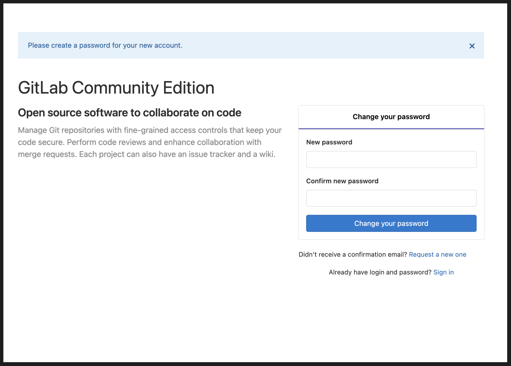
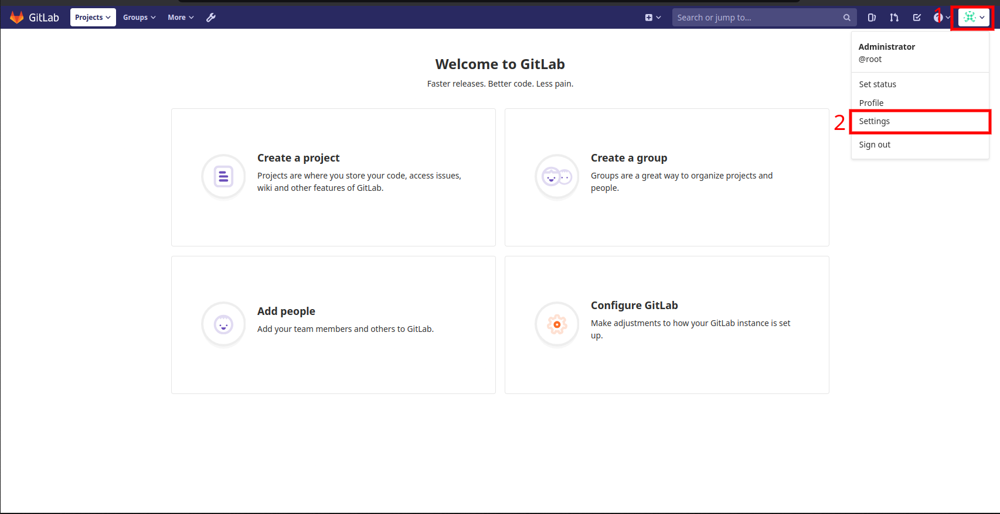
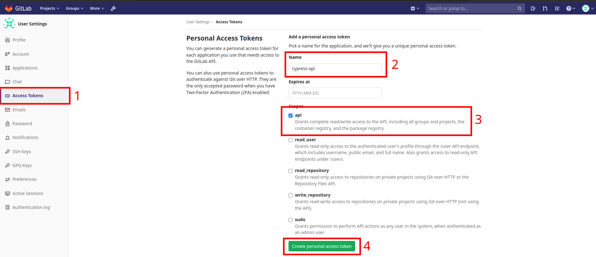

# Testes automatizados com Cypress - Intermediário

## O que foi abordado no curso

Durante o curso de testes automatizados com Cypress eu aprendi:

- Como configurar o ambiente local de desenvolvimento
- Como instalar e configurar o Cypress
- Como criar testes automatizados de interface gráfica de usuário
- Como criar testes automatizados de API (com _feedback_ visual no navegador)
- Como testar APIs que necessitam um _token_ de acesso
- Como criar testes otimizados e direto-ao-ponto
- Como salvar a sessão do usuário no navegador para posterior restauração
- Como validar se a sessão do usuário ainda é válida e como lidar com isso quando a mesma é invalidada
- Como fazer a limpeza e criação da massa de dados antes do teste começar
- Como proteger dados sensíveis, tais como senhas e _tokens_ de acesso
- Como organizar os testes e comandos customizados em diferentes "camadas" (_API, CLI, GUI_)
- Como estruturar os testes pensando em pré-condições, ações e resultados esperados
- Como gerar dados aleatórios para uso nos testes automatizados
- Como habilitar funcionalidades experimentais do Cypress
- Como executar comandos à nível de sistema operacional
- E como testar a leitura de arquivos

## Como executar os testes?

É necessario ter o docker e configurar a aplicação Git Lab Community

```bash
docker run --publish 80:80 --publish 22:22 --hostname localhost wlsf82/gitlab-ce
```

1. Apos a aplicação iniciar, acesse o endereço `http://localhost`, para definir a senha do usuario `root`



2. Em seguinda precisamos de um token para acessar a API do GitLab



3. Criar o token para acessar a API



Em seguida criar um arquivo chamado `cypress.env.json` com as informações criadas no passo anterior
```
{
  "user_name": "root",
  "user_password": "<senha>",
  "gitlab_access_token": "<token>"
}
```

```bash
# clonar o projeto
git clone https://github.com/Edmar-Sousa/cypress-curso.git 
cd cypress-curso

# instalar as dependencias
npm install

# iniciar os testes e2e
npm run test

# iniciar os teste pelo electron
npx cypress open
```

## Author
- Edmar Sousa. <br><br>
[](https://www.linkedin.com/in/edmar-sousa-9666b0201/)
[](https://github.com/Edmar-Sousa)
