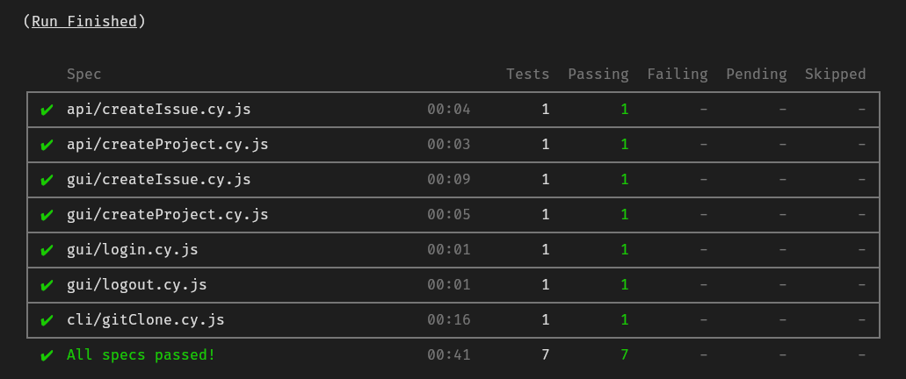

# Testes Automatizados com Cypress - Intermediário



## O que foi abordado no curso

Durante o curso de testes automatizados com Cypress, aprendi:

- Como configurar o ambiente local de desenvolvimento.
- Como instalar e configurar o Cypress.
- Como criar testes automatizados para a interface gráfica do usuário.
- Como criar testes automatizados de API (com _feedback_ visual no navegador).
- Como testar APIs que necessitam de um _token_ de acesso.
- Como criar testes otimizados e diretos ao ponto.
- Como salvar a sessão do usuário no navegador para posterior restauração.
- Como validar se a sessão do usuário ainda é válida e como lidar com isso quando ela for invalidada.
- Como fazer a limpeza e a criação da massa de dados antes do teste começar.
- Como proteger dados sensíveis, tais como senhas e _tokens_ de acesso.
- Como organizar os testes e comandos customizados em diferentes "camadas" (_API, CLI, GUI_).
- Como estruturar os testes pensando em pré-condições, ações e resultados esperados.
- Como gerar dados aleatórios para uso nos testes automatizados.
- Como habilitar funcionalidades experimentais do Cypress.
- Como executar comandos a nível de sistema operacional.
- E como testar a leitura de arquivos.

## Como executar os testes?

É necessário ter o Docker instalado e configurar a aplicação GitLab Community.

```bash
docker run --publish 80:80 --publish 22:22 --hostname localhost wlsf82/gitlab-ce
```

1. Após a aplicação iniciar, acesse o endereço `http://localhost` para definir a senha do usuário `root`.

   

2. Em seguida, é necessário gerar um token para acessar a API do GitLab.

   

3. Criar o token para acessar a API.

   

4. Clonando o repositório para a máquina local.

```bash
# Clonar o projeto
git clone https://github.com/Edmar-Sousa/cypress-curso.git
cd cypress-curso

# Instalar as dependências
npm install
```

5. Em seguida, criar um arquivo chamado `cypress.env.json` com as informações criadas no passo anterior.

```json
{
  "user_name": "root",
  "user_password": "<senha>",
  "gitlab_access_token": "<token>"
}
```

6. Executando os testes.

```bash
# Iniciar os testes e2e
npm run test

# Iniciar os testes pelo Electron
npx cypress open
```

## Autor

- Edmar Sousa. <br><br>
[](https://www.linkedin.com/in/edmar-sousa-9666b0201/)
[](https://github.com/Edmar-Sousa)

